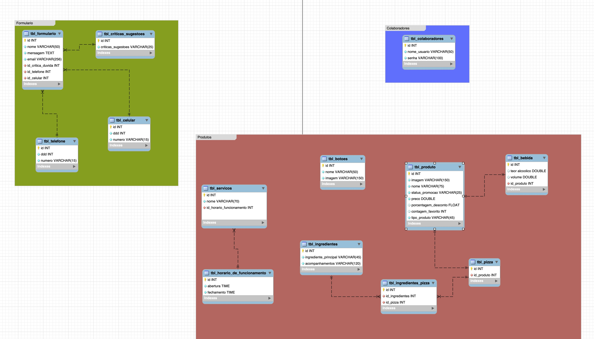

# Pizzaria buon Appetito

## Objetivo
Este projeto tem como objetivo criar um site no estilo Landing Page para uma pizzaria expondo as pizzas e bebidas vendidas e os serviços ofertados, uma espécie de 
cardápio online e um dashboard onde o dono da pizza pode adicionar, modificar e apagar todos os itens que serão apresentados para o usuário

#

## Banco de Dados

Modelo lógico do banco de dados 

   

#

## Back-end

O back-end foi dividido em duas API's, uma para a página do usuario e a outra para o dashboard, no total tivemos 17 endpoints sendo 9 GET's, 2 PUT's, 1 DELETE e 5 POST's distribuidos entre produto, colaborador, formulario que foram as tabelas mais importantes

1. <a href="https://github.com/HeitorPontieri/pizza-backend">Back-End</a>

#

## Front-end

O site utilizou as linguagens de marcação HTML para estruturação e CSS para estilização, porém tambëm foi utilizado O javaScript, para permitir interligar o Front-End com o Back-End, além disso foi utilizado para deixar a pagina mais dinámica 

#

## Links

1. <a href="https://www.figma.com/file/uTX3Cw8bLut5730zDGhfGL/pizzaria-buon-appetito?node-id=0%3A1&t=w1gHPveDjE40PFfA-3"> Figma</a>
2. <a href="https://github.com/HeitorPontieri/pizza-frontend">Front-End</a>
3. <a href="heitorpontieri.github.io/pizza-frontend/">Site</a>
4. <a href="https://trello.com/b/V7khdlyk/buon-appetito"> Trello</a>

#

## Tecnologias Utilizadas

 
  

           

